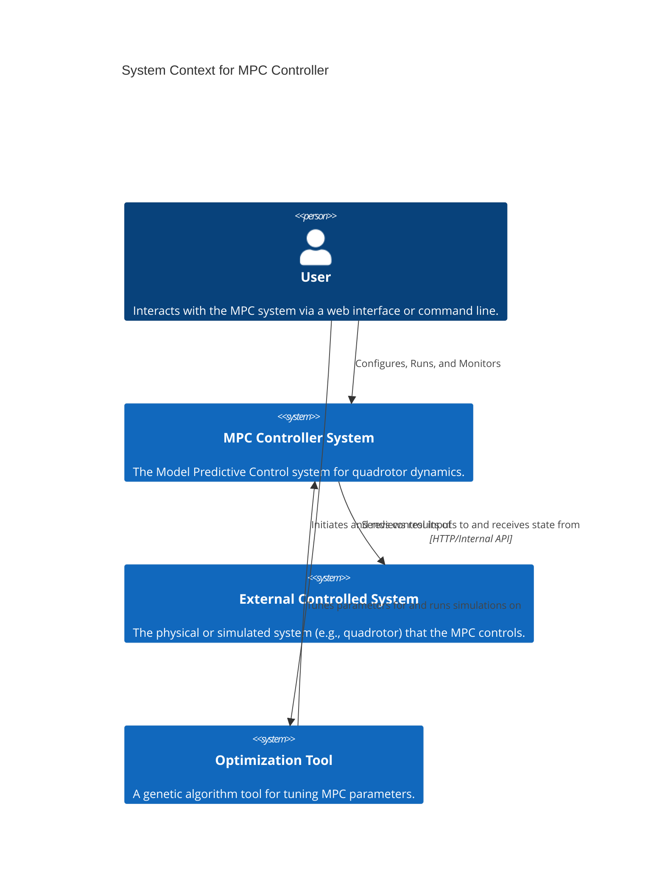

```mermaid
C4Context
    title System Context for MPC Controller
    
    Person(user, "User", "Interacts with the MPC system via a web interface or command line.")
    
    System(mpc_system, "MPC Controller System", "The Model Predictive Control system for quadrotor dynamics.")
    System(external_system, "External Controlled System", "The physical or simulated system (e.g., quadrotor) that the MPC controls.")
    System(optimization_tool, "Optimization Tool", "A genetic algorithm tool for tuning MPC parameters.")

    Rel(user, mpc_system, "Configures, Runs, and Monitors")
    Rel(mpc_system, external_system, "Sends control inputs to and receives state from", "HTTP/Internal API")
    Rel(user, optimization_tool, "Initiates and reviews results of")
    Rel(optimization_tool, mpc_system, "Tunes parameters for and runs simulations on")
```